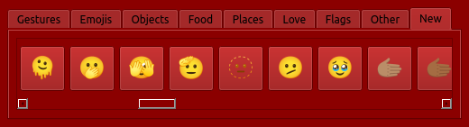

<h2 align=center>Mint Emojis</h2>
<p align=center>A simple emoji picker for Linux Mint 21.1 "Vera" (or other versions) using Python with a PyQt5 GUI.</p>

<br>

<p align=center></p>

<br>

<h3 align=center>Download</h3>

### Either head over to the <a href="https://github.com/Svxy/mint-emojis/releases/latest">latest release</a> page to download the zip directly,<br>or from your terminal with this command:

```console
curl -sL "$(curl -s https://api.github.com/repos/Svxy/mint-emojis/releases/latest | grep 'browser_' | grep 'Mint Emojis.zip' | cut -d\" -f4)" -o "Mint Emojis.zip"
```

<br>

<h3 align=center>Contribute</h3>

### <sup>Want to help improve Mint Emojis? follow these steps:</sup>

If you are new to python development or have a completely outdated version of python, an <a href='install.sh'>install</a> script is provided in this repo to install Python 3.10 and the project requirements.

##### Firstly clone the repo by entering the following commands into your terminal:

```console
git clone https://github.com/Svxy/mint-emojis
```

```console
cd mint-emojis
```

```console
pip install -r requirements.txt
```

Make whatever changes you want. <b>(Be sure to include the output binary file in your pull request)</b>

### <sup>Compiling:</sup>

```console
pyinstaller main.py --name "Mint Emojis" --icon "assets/icon.ico" --onefile --clean --windowed --noconsole
```

<br>

<h2 align=center><sup>This project released under the <a href='LICENSE'><b>Apache 2.0 License</b></a>.</sup></h2>

<h3 align=center>Copyright © 2023-2024 | <a href='https://tnyavnto.com'>tnyavnto.com</a></h3>